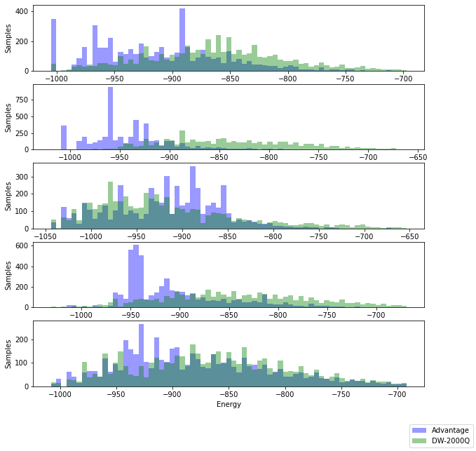

[](
  https://circleci.com/gh/dwave-examples/pegasus-notebook)

# Exploring the Pegasus Topology

D-Wave's newest quantum computer, Advantage, introduces a quantum processing
unit (QPU) with a new architecture: the Pegasus family of topologies. This
notebook explains the Pegasus topology and how it enables superior performance
to previous generations of quantum computers.

The notebook has the following sections:

1. **The Pegasus Advantage** demonstrates and explains the performance differences
   between the previous and new QPU architectures.
2. **Navigating the Topology** describes the new topology and presents Ocean tools
   that help you use it.
3. **Example Problem: RANr** solves a hard problem on Advantage and D-Wave 2000Q
   quantum computers.

## QPU Architecture: Topologies

The layout of the D-Wave QPU is critical to formulating an objective
function in a format that a D-Wave annealing quantum computer can solve.
Although Ocean software automates the mapping from the linear and quadratic
coefficients of a quadratic model to qubit bias and coupling values set on the
QPU, you should understand it if you are using QPU solvers directly because it
has implications for the problem-graph size and solution quality.

The D-Wave QPU is a lattice of interconnected qubits.
While some qubits connect to others via couplers, the D-Wave QPU is not fully
connected. Instead, the qubits of D-Wave annealing quantum computers interconnect
in one of the following topologies:

* Chimera for D-Wave 2000Q and earlier generations of QPUs
* Pegasus for Advantage QPUs

These topologies are described in D-Wave's
[system documentation](https://docs.dwavesys.com/docs/latest/c_gs_4.html).



## Installation

You can run this example
[in the Leap IDE](https://ide.dwavesys.io/#https://github.com/dwave-examples/pegasus-notebook).

Alternatively, install requirements locally (ideally, in a virtual environment):

    pip install -r requirements.txt


## Usage

To enable notebook extensions:

```bash
jupyter contrib nbextension install --sys-prefix
jupyter nbextension enable toc2/main
jupyter nbextension enable exercise/main
jupyter nbextension enable exercise2/main
jupyter nbextension enable python-markdown/main

```

To run the notebook:

```bash
jupyter notebook
```

## License

See [LICENSE](LICENSE.md) file.
